# Minimal implementation of diffusion models ⚛

A minimal implementation of diffusion models with the goal to democratize the use of synthetic data from these models.

Check out the [experimental results](#how-useful-is-synthetic-data-from-diffusion-models-) section for quantitative numbers on quality of synthetic data and [FAQs](#faqs) for a broader discussion. We experiments with nine commonly used datasets, and released all [assets](https://drive.google.com/drive/folders/1CfgFQSsIIfxcpVjIbEWLi2csGTeAo4O2?usp=sharing), including models and synthetic data for each of them. 

**Requirements:** `pip install scipy opencv-python`. We assume torch and torchvision are already installed.

### Structure

```
main.py  - Train or sample from a diffusion model.
unets.py - UNet based network architecture for diffusion model.
data.py  - Common datasets and their metadata.
──  scripts
     └── train.sh  - Training scripts for all datasets.
     └── sample.sh - Sampling scripts for all datasets.
```

### Training
Use the following command to train the diffusion model on four gpus.

```
CUDA_VISIBLE_DEVICES=0,1,2,3 python -m torch.distributed.launch --nproc_per_node=4 main.py \
  --arch UNet --dataset cifar10 --class-cond --epochs 500
```

We provide the exact script used for training in `./scripts/train.sh`. 

### Sampling
We reuse `main.py` for sampling but with the `--sampling-only` only flag. Use the following command to sample 50K images from a pretrained diffusion model. 

```
CUDA_VISIBLE_DEVICES=0,1,2,3 python -m torch.distributed.launch --nproc_per_node=4 main.py \
  --arch UNet --dataset cifar10 --class-cond --sampling-only --sampling-steps 250 \
  --num-sampled-images 50000 --pretrained-ckpt path_to_pretrained_model
```

We provide the exact script used for sampling in `./scripts/sample.sh`. 


## How useful is synthetic data from diffusion models? 🤔
>**Takeaway:** Across all datasets, training only on synthetic data suffice to achieve a competitive classification score on real data.

**Goal:** Our goal is to not only measure photo-realism of synthetic images but also measure how well synthetic images cover the data distribution, i.e., how diverse is synthetic data. Note that a generative model, commonly GANs, can generate high-quality images, but still fail to generate diverse images. 

**Choice of datasets:** We use nine commonly used datasets in image recognition. The goal was to multiple datasets was to capture enough diversity in terms of the number of samples, the number of classes, and coarse vs fine-grained classification. In addition, by using a common setup across datasets, we can test the success of diffusion models without any assumptions about the dataset. 

**Diffusion model:** For each dataset, we train a class-conditional diffusion model. We choose a modest size network and train it for a limited number of hours on a 4xA4000 cluster, as highlighted by the training time in the table below. Next, we sample 50,000 synthetic images from the diffusion model.

**Metric to measure synthetic data quality:** We train a ResNet50 classifier on only *real* images and another one on only *synthetic* images and measure their accuracy on the validation set of *real* images. This metric is also referred to as [classification accuracy score](https://arxiv.org/abs/1905.10887) and it provides us a way to measure both quality and diversity of synthetic data in a unified manner across datasets.

>**Released assets for each dataset**: [Pre-trained Diffusion models](https://drive.google.com/drive/folders/1BMTpNF-FSsGrWGZomcM4OS36CootbLRj?usp=sharing), [50,000 synthetic images](https://drive.google.com/drive/folders/1KRWie7honV_mwPlmTgH8vrU0izQXm4UT?usp=sharing) for each dataset, and [downstream clasifiers](https://drive.google.com/drive/folders/1nnHSskOWzDj-JUcSODxmZiuOSFRmV25u?usp=sharing) trained with real-only or synthetic-only dataset.

*Table 1*: Training images and classes refer to the number of training images and the number of classes in the dataset. Training time refers to the time taken to train the diffusion model. Real only is the test set accuracy of ResNet-50 model trained on *only* real training images. Synthetic accuracy is the test accuracy of the ResNet-50 model trained on *only* 50K synthetic images.

|                                       Dataset                                       | Training images | Classes | Training time (hours) | Real only | Synthetic only |
| :---------------------------------------------------------------------------------: | :-------------: | :-----: | :-------------------: | :-------: | :------------: |
|                     [MNIST](http://yann.lecun.com/exdb/mnist/)                      |     60,000      |   10    |          2.1          |   99.6    |      99.0      |
|                  [MNIST-M](https://arxiv.org/pdf/1505.07818v4.pdf)                  |     60,000      |   10    |          5.3          |   99.3    |      97.3      |
|               [CIFAR-10](https://www.cs.toronto.edu/~kriz/cifar.html)               |     50,000      |   10    |         10.7          |   93.8    |      87.3      |
| [Skin Cancer*](https://www.kaggle.com/c/siim-isic-melanoma-classification/overview) |      33126      |    2    |         19.1          |   69.7    |      64.1      |
|                   [AFHQ](https://arxiv.org/pdf/1912.01865v2.pdf)                    |      14630      |    3    |          8.6          |   97.9    |      98.7      |
|             [CelebA](https://mmlab.ie.cuhk.edu.hk/projects/CelebA.html)             |     109036      |    4    |         12.8          |   90.1    |      88.9      |
|      [Standford Cars](https://ai.stanford.edu/~jkrause/cars/car_dataset.html)       |      8144       |   196   |          7.4          |   33.7    |      76.6      |
|          [Oxford Flowers](https://www.robots.ox.ac.uk/~vgg/data/flowers/)           |      2040       |   102   |          6.0          |   29.3    |      76.3      |
|                   [Traffic signs](https://benchmark.ini.rub.de/)                    |      39252      |   43    |          8.3          |   96.6    |      96.1      |

\* Due to heavy class imbalance, we use AUROC to measure classification performance.

*Note:* Except for CIFAR10, MNIST, MNIST-M, and GTSRB, we use 64x64 image resolution for all datasets. The key reason to use a lower resolution was to reduce the computational resources needed to train the diffusion model. 

**Discussion:** Across most datasets training only on synthetic data achieves competitive performance with training on real data. It shows that the synthetic data 1) has high-quality images, otherwise the model wouldn't have learned much from it 2) high coverage of distribution, otherwise, the model trained on synthetic data won't do well on the whole test set. Even more, the synthetic dataset has a unique advantage: we can easily generate a very large amount of it. This difference is clearly visible for the low-data regime (*flowers* and *cars* dataset), where training on synthetic data (50K images) achieves much better performance than training on real data, which has less than 10K images. A more principled investigation of sample complexity, i.e., performance vs number-of-synthetic-images is available in one of my [previous papers (fig. 9)](https://arxiv.org/pdf/2104.09425.pdf).


## FAQs
**Q.** Why use diffusion models? \
**A.** This question is super broad and has multiple answers. 1) They are super easy to train. Unlike GANs, there are no training instabilities in the optimization process. 2) The mode coverage of the diffusion models is excellent where at the same time the generated images are quite photorealistic. 3) The training pipeline is also consistent across datasets, i.e., no assumption about the data. For all datasets above, the only parameter we changed was the amount of training time. 

**Q.** Is synthetic data from diffusion models much different from other generative models, in particular GANs? \
**A.** As mentioned in the previous answer, synthetic data from diffusion models have much higher coverage than GANs, while having a similar image quality. Check out the [this](https://arxiv.org/abs/2105.05233) previous paper by Prafulla Dhariwal and Alex Nichol where they provide extensive results supporting this claim. In the regime of robust training, you can find a more quantitive comparison of diffusion models with multiple GANs in one of my previous [papers](https://arxiv.org/abs/2104.09425). 

**Q.** Why classification accuracy on some datasets is so low (e.g., flowers), even when training with real data? \
**A.** Due to many reasons, current classification numbers aren't meant to be competitive with state-of-the-art. 1) We don't tune any hyperparameters across datasets. For each dataset, we train a ResNet50 model with 0.1 learning rate, 1e-4 weight decay, 0.9 momentum, and cosine learning rate decay. 2) Instead of full resolution (commonly 224x224), we use low-resolution images (64x64), which makes classification harder. 

**Q.** Using only synthetic data, how to further improve the test accuracy on real data? \
**A.** Diffusion models [benefit tremendously](https://arxiv.org/abs/2102.09672) from scaling of the training setup. One can do so by increasing the network width (base_width) and training the network for more epochs (2-4x). 


## References
This implementation was originally motivated by the [original implmentation](https://github.com/hojonathanho/diffusion) of diffusion models by Jonathan Ho. I followed the recent [PyTorch implementation](https://github.com/hojonathanho/diffusion) by OpenAI for common design choices in diffusion models. 

The experiments to test out the potential of synthetic data from diffusion models are inspired by one of [my previous work](https://arxiv.org/abs/2104.09425). We found that using synthetic data from the diffusion model alone surpasses benefits from multiple algorithmic innovations in robust training, which is one of the simple yet extremely hard problems to solve for neural networks. The next step is to repeat the Table-1 experiments, but this time with robust training. 

## Visualizing real and synthetic images
For each data, we plot real images on the **left** and synthetic images on the **right**. Each row corresponds to a unique class while classes for real and synthetic data are identical. 

<p align="center">
  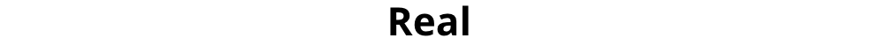
&nbsp; &nbsp;
  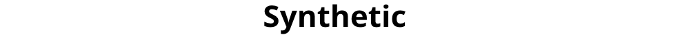
</p>

#### MNIST
<p align="center">
  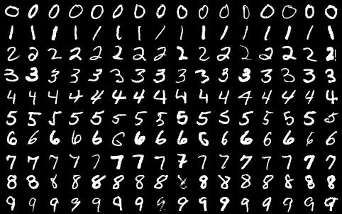
&nbsp; &nbsp;
  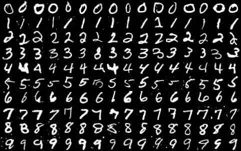
</p>

#### MNIST-M
<p align="center">
  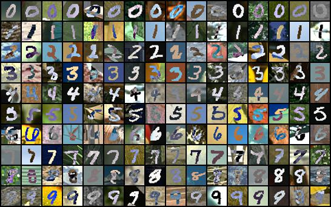
&nbsp; &nbsp;
  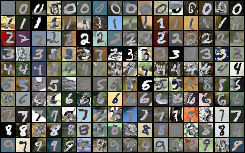
</p>


#### CIFAR-10
<p align="center">
  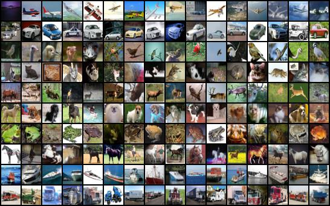
&nbsp; &nbsp;
  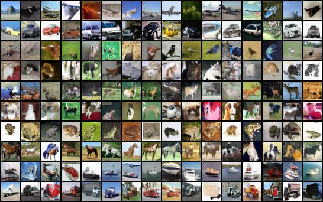
</p>

#### GTSRB
<p align="center">
  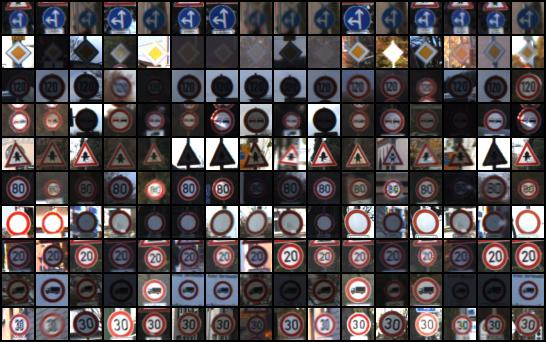
&nbsp; &nbsp;
  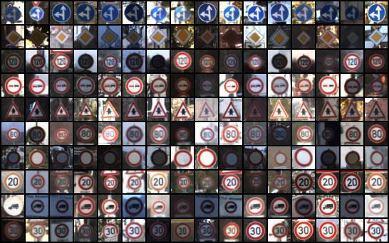
</p>

#### Celeb-A
<p align="center">
  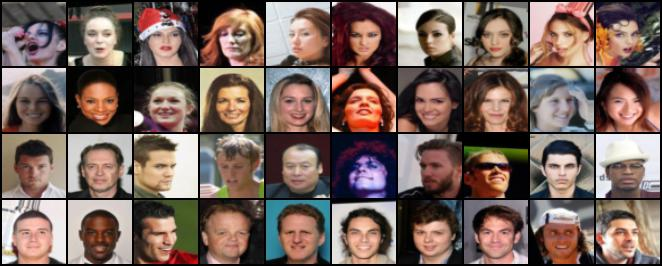
&nbsp; &nbsp;
  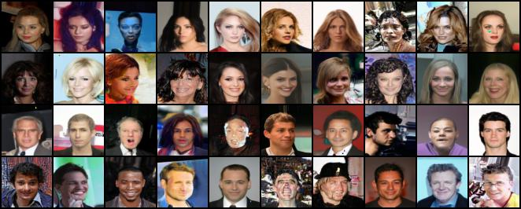
</p>


#### AFHQ
<p align="center">
  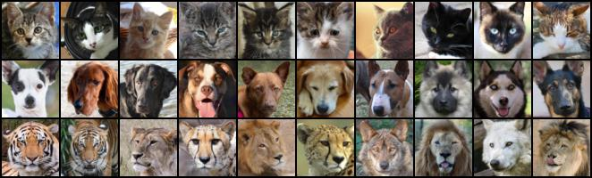
&nbsp; &nbsp;
  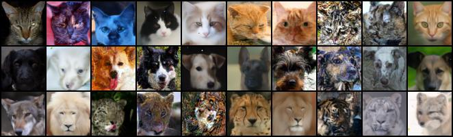
</p>

#### Cars
<p align="center">
  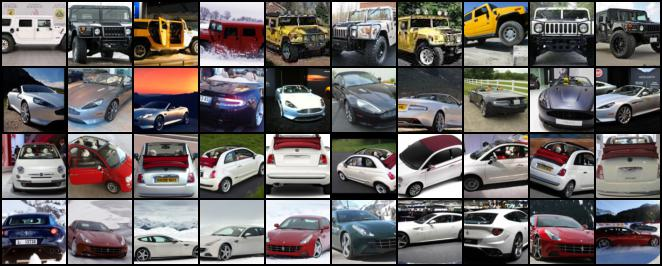
&nbsp; &nbsp;
  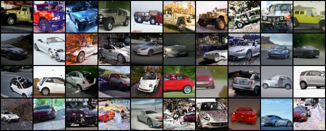
</p>

#### Flowers
<p align="center">
  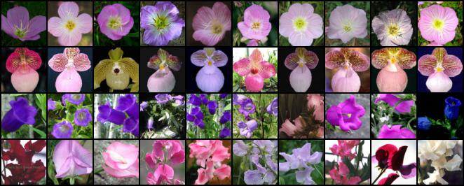
&nbsp; &nbsp;
  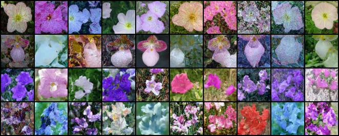
</p>

#### Melanoma (Skin cancer)
<p align="center">
  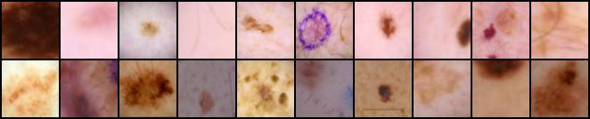
&nbsp; &nbsp;
  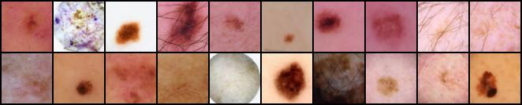
</p>

**Note**: Real images for each dataset follow the same license as their respective dataset.


